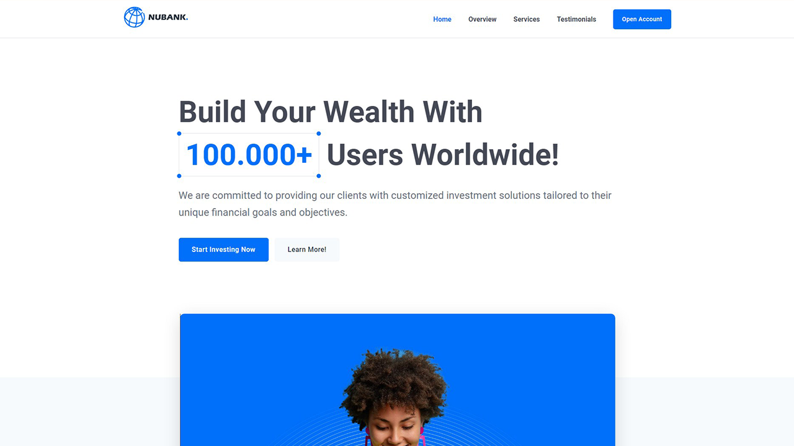

# NUBANK Prject

## check out the <a href="https://nubank-nouregy.netlify.app/" target="_blank">live project here</a>

NUBANK Template - Built with Pure Javascript

<h2>Main Futures</h2>
<ul>
  <li>Creative Layout</li>
  <li>Retina Ready</li>
  <li>Loading spinner</li>
  <li>Popup Modal</li>
  <li>animated fade Links</li>
  <li>Header Sticky</li>
  <li>Section Animate</li>
  <li>Lazy Images</li>
  <li>tabs Component</li>
  <li>Slider Component</li>
</ul>

<h2>Built with</h2>
<ul>
  <li>HTML, CSS,</li>
  <li>Pure JAVASCRIPT</li>
</ul>

<h2>My Social Media</h2>
<ul>
    <li>Twitter : <a href="https://twitter.com/iNourEgy" target="_blank">@iNourEgy</a></li>
    <li>LinkedIn : <a href="https://www.linkedin.com/in/nouregy/" target="_blank">@NourEgy</a></li>
    <li>Themeforest : <a href="https://themeforest.net/user/nouregy" target="_blank">NourEgy</a></li>
    <li>Website : <a href="https://nour-egy.com/" target="_blank">Nou-Egy.com</a></li>
</ul>
